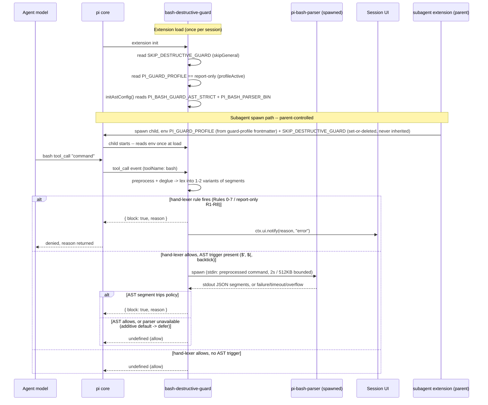
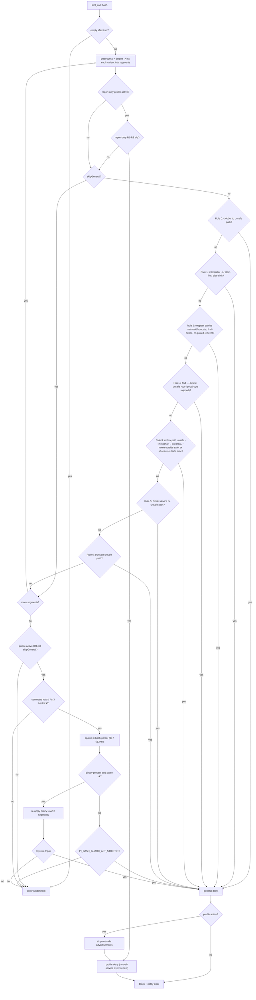
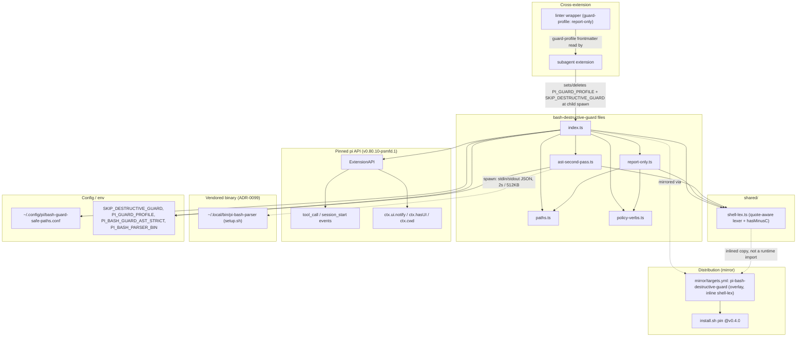

# bash-destructive-guard

Pi extension that denies `bash` tool calls invoking destructive operations against paths outside a configurable safe list — `rm`/`mv`, output-redirect clobber (`>`/`>|`), `find -delete`, `dd of=`, and `truncate` (ADR-0072). Companion to `secrets-guard` — together they bracket the two highest-frequency catastrophic outcomes (data destruction and credential exfiltration). The quote-aware lexer lives in [`../shared/shell-lex.ts`](https://github.com/psmfd/pi-config/blob/main/agent/extensions/shared/README.md); this extension owns the destructive-operation policy.

## Install

```sh
pi install git:github.com/psmfd/pi-bash-destructive-guard
```

Try it first without installing: `pi -e git:github.com/psmfd/pi-bash-destructive-guard`.

## Hooked events

- **`tool_call` for `bash`** — preprocesses, runs a quote-aware lexer, and applies layered per-segment checks.
- **`session_start`** — registered only when `SKIP_DESTRUCTIVE_GUARD=1`, to announce the bypass once.

The runtime communication — load-time env capture, the parent-controlled subagent spawn signaling, the `tool_call` verdict path, and the on-demand `pi-bash-parser` spawn — is:



## Threat model

This guard provides **blast-radius isolation** against the agent issuing a *naive or mistaken* destructive command (`rm /etc/foo`, `rm;rm /x`, `sudo rm`, `find . -exec rm`, `echo <b64> | base64 -d | sh`, a pasted one-liner). It is **not** a sandbox and **not** a defense against an adversary deliberately crafting shell to evade it — static analysis of shell is undecidable. The still-open fail-open residual gaps are the *runtime-value* evasions no single-command-string parser can resolve: parameter-default expansion (`${x:-rm}`), variable indirection (`R=rm; $R /x`), a value-producing substitution whose value only exists at runtime (`$(echo rm) -rf /`), and base64-decode pipelines. ANSI-C quoting (`$'\x72m'`) and destructive verbs nested inside a command substitution are **no longer** fail-open — the AST second pass (ADR-0100, shipped) re-applies the policy to a real parse and closes them; see [AST second pass](#ast-second-pass-506-adr-0100). The guard also **cannot** see a destructive verb that only appears in a file a second interpreter reads — the GuardFall Makefile-exfil class, where the string this guard receives is merely `make test`. The sound boundary against that class is below the shell (`$HOME` scoping / sandbox / egress control, #507). Anyone with shell and intent can also set `SKIP_DESTRUCTIVE_GUARD=1`.

## Detection model (#297, extended by ADR-0072)

**Preprocess** (`../shared/shell-lex.ts`): collapse `\<newline>` line continuations, strip heredoc bodies (their content is data, not commands), normalize `$IFS`/`${IFS}` to a space (word-boundary anchored, so `$IFSX` is left intact).

**Two-variant analysis:** the checks run over both the preprocessed command **and** a *deglued* variant with word-internal empty command substitutions removed (`r$(true)m` → `rm`); a rule tripping in either variant blocks. This closes the glued empty-substitution obfuscation conservatively while leaving space-separated value substitutions (`rm $(echo /tmp)/x`) untouched (no path-arg false positives).

**Quote-aware lexer:** split each variant into command-position *segments* on **unquoted** control operators and group/subshell/substitution boundaries (`;`, `|`, `&`, `(`, `)`, newline, backtick); strip surrounding quotes and escaping backslashes from each token; record whether a segment reads a script from stdin/a file (`<`, `<<`, `<<<`), is the downstream stage of a single `|` pipe, and any output redirections (`>`, `>|`, `>>`) with their targets. `||` (logical-OR) is distinguished from a `|` pipe. Leading `NAME=value` env assignments — including quoted multi-word values — are dropped so the real verb surfaces. The verb is basename-normalized (`/bin/rm` → `rm`).

**Per segment (in order):**

0. **Output-redirect clobber** (`>`, `>|`) to a path outside the safe list → **DENY** (`>>` append is out of scope).
1. **Shell interpreter with `-c`, reading a script from stdin/file, OR as a `|` pipeline sink** (`bash -c '...'`, `bash<<<'...'`, `bash <<EOF`, `… | sh`) → **DENY** (bypass vector).
2. **Exec-wrapper verb** (`eval`, `xargs`, `sudo`, `su`, `env`, `nohup`, `command`, `timeout`, `find`, `exec`, …) whose tokens carry a destructive operation → **DENY** (the wrapped target is not statically validatable). The wrapped surface mirrors direct invocation: `rm`/`mv`/`dd`/`truncate` (basename-normalized, so `sudo /bin/rm` is caught), `find` co-occurring with `-delete`, or a quote-embedded `>` clobber that never surfaces as a structural redirect (`eval 'echo x > /etc/passwd'`). Word-level, so a path component named `rm` does not overblock.
3. **Plain `rm` or `mv`** — extract path arguments (skipping flags, honoring `--`), then for each path token:
   - Path containing shell metacharacters (`$`, `` ` ``, `|`, `;`, `&`, `(`, `)`, `{`, `}`) → **DENY**
   - Path containing `..` traversal segment → **DENY**
   - `~`/`~/…` home path resolved against `$HOME` and safe-checked; unresolvable `~user/…` → **DENY** (a `~` target is *not* relative to `cwd`)
   - Absolute path not under any safe path → **DENY**
   - Relative path (not starting with `/` or `~`) → **ALLOW** (implicitly within `cwd`)
4. **`find … -delete`** rooted at an unsafe leading path → **DENY** (a safe/relative/absent root is allowed, consistent with `rm`). GNU find global options before the root (`-H`/`-L`/`-P`/`-D`/`-O`) are skipped so `find -L /etc -delete` does not misparse to an empty (cwd-safe) root. Evaluated in source **before** rule 3 (`find` is also a wrapper — rule 2 covers `-exec rm`).
5. **`dd of=<target>`** — a `/dev/*` device target → **DENY** unconditionally; any other `of=` target is path-checked like `rm`.
6. **`truncate -s <n> <path>`** — path-checked like `rm` (the `-s`/`--size` value is skipped).
7. **Any other verb** → **ALLOW**.

Because `$(...)`/backtick/subshell bodies become their own segments, a destructive verb inside them is path-validated directly (safe paths allowed, unsafe blocked) rather than blunt-blocked — so a compound like `echo $(rm /tmp/scratch)` is allowed while `echo $(rm /etc/x)` is denied.

The full per-segment decision ladder — profile gate, general Rules 0→4→3→5→6, the deny-message sanitizer, and the trailing AST gate:



## AST second pass (#506, ADR-0100)

The hand-lexer above is a pragmatic approximation, not a shell grammar. Two shapes defeat it structurally: ANSI-C-quoted verbs/flags (`$'\x72m' /x`, where the byte sequence only becomes `rm` after `$'…'` decoding) and a destructive verb sitting in a nested command substitution as its own command position. `ast-second-pass.ts` closes both by getting a *real* parse.

- **Cheap trigger.** The pass only runs when the command contains `$'`, `$(`, or a backtick (`AST_TRIGGER_RE`). The overwhelming common case never pays for a subprocess spawn.
- **Real parse.** When triggered, it spawns the vendored **`pi-bash-parser`** binary (installed by `setup.sh` at `~/.local/bin/pi-bash-parser`; override with `PI_BASH_PARSER_BIN`), walks the returned AST for command positions, and re-applies the *same* policy — general or report-only — to each.
- **Additive by default.** The pass only ever *adds* a denial (binary present **and** parse succeeds **and** policy trips). If the binary is absent or the parse fails, it defers to the hand-lexer verdict — it never weakens a block the lexer already made. Setting `PI_BASH_GUARD_AST_STRICT=1` flips this to deny-by-default: a command that requires the second opinion but cannot get one (binary missing) is refused rather than allowed.

## Safe paths

Built-in: `/tmp`, the active pi `cwd` (and everything beneath it).

User-extendable via `~/.config/pi/bash-guard-safe-paths.conf`:

```text
# One path per line. Blank lines and # comments ignored.
# Paths are matched by exact equality or as a prefix with trailing /.
/var/tmp
/home/me/sandbox
/srv/scratch
```

The `cwd` entry means the extension does not block destructive operations within the project pi is operating on. That is intentional — destructive operations within the project (e.g. `rm node_modules`) are part of normal workflow and the project's own VCS is the recovery mechanism. The same reasoning resolves #554 Observation A: relative/in-cwd writes stay ungated in the general guard; the in-cwd write gate belongs to the report-only profile below (ADR-0091).

Safe-list entries and absolute target paths are **canonicalized** (`realpathSync`, symlinks resolved; a not-yet-existing target resolves via its nearest existing ancestor) before comparison — #554 Observation B: on macOS a `/var/…` spelling never string-prefix-matched the canonical `/private/var/…` cwd entry, falsely denying in-cwd paths. Canonical comparison also closes the reverse under-block (a symlink inside cwd pointing outside the safe list previously passed on its cwd spelling).

## Report-only profile (ADR-0091)

When the child process env carries `PI_GUARD_PROFILE=report-only` — exported by the subagent extension for wrappers declaring `guard-profile: report-only` frontmatter (today: the `linter`) — `report-only.ts` adds a mutation gate on top of the general rules, turning the wrapper's prose report-only contract into a mechanical one (#551, motivated by the #535/ADR-0082 evaluation where a fix-framed task defeated the prose contract):

- Mutating flags on any verb (`--fix`, `--unsafe-fixes`, `--write`, `--apply`, `--in-place`, …), word-level so wrapper-quoted payloads are caught.
- In-place editors (`sed -i`, `perl -i`, `gofmt`/`goimports`/`shfmt -w`) and default-write formatters without their check flag (`ruff format`, `dotnet format`, `black`, `isort`, `rustfmt`, `cargo fmt`).
- ANY output redirect or file-mutation verb targeting a non-`/tmp` path — **relative, in-cwd paths included** (the #535 `cat > transform.py` hole). `/tmp` scratch stays allowed.
- git mutations (read-only subcommand allowlist), package-manager verbs (`npm`/`yarn`/`pnpm`/`pip`; `npx <tool>` itself is sanctioned — the wrapped tool's flags are still scanned), and the interpreter bypass shapes.
- Exec-wrappers, two-class (the shared `WRAPPER_VERBS` set in `policy-verbs.ts`): flag-free **transparent** prefix wrappers (`sudo`, `env K=V`, `timeout 60`, …) recurse so the full rule set evaluates the real verb — `timeout 60 ruff check` stays allowed, `sudo rustfmt` is denied; **opaque** wrappers (`eval`, `xargs`, `su`, …) and any transparent wrapper carrying a dash-flag (a value-consuming flag like `sudo -u <user>` would misparse its value as the verb) take a fail-closed word-scan denying wrapped mutating verbs, conditional formatter/tool names, quoted redirects, and shell interpreters. `find` with `-delete`, or `-exec`/`-execdir` carrying a denied word, is denied regardless of root; read-only shapes (`find … -exec shellcheck {}`, `xargs shellcheck`) stay allowed. Belt-and-braces: a general-rule denial that fires while the profile is active has override advertisements scrubbed from its message.

Profile deny messages advertise **no self-service override** (the #535 lesson: the general guard's own denial text taught the model the SKIP bypass). `SKIP_DESTRUCTIVE_GUARD=1` waives the general rules only — the profile handler stays installed (announced at session start). The env var is set-or-deleted by the parent at spawn (subagent LOCAL PATCH #7a): never inherited, not settable from inside the child session. The trust model — the parent sets the profile, the child cannot un-certify itself — is enforced by the guard-profile shadowing gate (ADR-0093).

## Refusal policy (per-rule)

The `damage-control-continue` pattern (from `disler/pi-vs-claude-code`, evaluated in #69) distinguishes **hard refusals** — where any retry is wrong and the agent should escalate to the user — from **continue-eligible** blocks, where the agent can recover by trying a modified approach. This extension classifies its rules accordingly; `reason:` payloads carry explicit guidance:

| Rule | Policy | Rationale |
|---|---|---|
| Output-redirect clobber to unsafe path (rule 0) | Continue-eligible | The agent can redirect to a cwd-relative or `/tmp` path, or `>>`-append if overwrite was not intended. |
| Shell interpreter with `-c` / stdin script / pipe sink (rule 1) | **Hard refusal** | The bypass intent itself is what is blocked, not the wrapped command. Re-wrapping or re-piping the same payload is never the right retry. `reason:` instructs the model to invoke the verb directly instead. |
| Exec-wrapper carrying `rm`/`mv` (rule 2) | Continue-eligible | The agent can invoke the destructive command directly so its path can be validated, scope it under `/tmp`/cwd, or set the override. |
| `rm`/`mv` path with shell metacharacters (rule 3a) | Continue-eligible | The agent can expand the glob/variable and issue the verb with literal paths. |
| `rm`/`mv` path with `..` traversal (rule 3b) | Continue-eligible | The agent can resolve to an absolute path or drop the `..` segments. |
| `rm`/`mv` absolute path outside safe list (rule 3c) | Continue-eligible | The agent can switch to a cwd-relative path, edit `~/.config/pi/bash-guard-safe-paths.conf`, or operate under `/tmp`. |
| `find -delete` / `dd of=` / `truncate` on unsafe target (rules 4–6) | Continue-eligible | Same recovery as `rm`/`mv`: scope the target under cwd/`/tmp`, extend the safe-paths file, or set the override. `dd` to a `/dev/*` device is not path-recoverable — use a regular file. |

Neither the upstream `damage-control.ts` nor `damage-control-continue.ts` were vendored. The pattern adoption is pi-native: pi's `{block, reason}` return is already the no-abort path (this extension has never called `ctx.abort()`), so the actionable change is the per-rule policy classification and adaptive-feedback wording in `reason:` payloads.

## Override

The override **announces itself via `ctx.ui.notify`** on use — silent overrides are not supported (ADR-0022 § Q5, backported per issue #258).

| Override | Scope |
|---|---|
| `SKIP_DESTRUCTIVE_GUARD=1` in pi's env | Whole pi session — waives the **general rules** (no `tool_call` handler unless a report-only profile is active, in which case the handler stays installed applying profile rules only); announced once at session start via `warning`-level notify naming what survives |

The two other recognized env vars change *posture*, not bypass, and belong to the [AST second pass](#ast-second-pass-506-adr-0100): `PI_BASH_GUARD_AST_STRICT=1` flips the AST pass from additive to deny-by-default (a command needing the second opinion but unable to get one is refused), and `PI_BASH_PARSER_BIN` overrides the resolved `pi-bash-parser` binary path. Both are captured once at extension load, like `SKIP_DESTRUCTIVE_GUARD`.

In non-UI sessions (e.g. `pi -p`) the notify call is suppressed cleanly via the `ctx.hasUI` guard.

There is no per-call override. If you need to delete something outside the safe list and outside `cwd`, either run the command directly in a separate terminal or extend `bash-guard-safe-paths.conf` first.

## Why not also block `mkfs`, `chmod -R 777 /`, `shred`, `git push --force`?

ADR-0072 added the highest-incident destructive operations beyond `rm`/`mv` (`>`/`>|` clobber, `find -delete`, `dd of=`, `truncate`). The still-deferred set — `shred`, `wipefs`, `mkfs.*`, `parted`/`sgdisk`, and out-of-domain blast-radius verbs like `git clean -fdx` / `git reset --hard` / `git push --force` — is enumerated in ADR-0072 § Q4 as a later decision: either low model-invocation frequency with high false-positive cost (e.g. `chmod` on legitimate project files) or a different domain that warrants its own rule. New verbs slot into the per-segment dispatch in `index.ts`.

## Architecture

Module structure, the pinned pi API surface, the vendored parser binary, cross-extension env touchpoints, and the distribution path:



Governing decisions: ADR-0072 (GuardFall hardening), ADR-0091 (report-only profile), ADR-0093 (guard-profile shadowing gate), ADR-0097 (bash-tool OS isolation), ADR-0099 (parser vendor), ADR-0100 (AST second pass), ADR-0112 (wrapper/tilde bypass reconciliation).

## Limitations

- The lexer (`../shared/shell-lex.ts`) is quote-aware (single/double quotes, backslash escapes, env assignments, `$IFS`) but is **not** a full POSIX shell parser. The remaining fail-open residual gaps are the *runtime-value* evasions (`${x:-rm}`, variable indirection, value-producing/non-glued substitution, base64-decode pipelines) — adversarial, not accidental, and unresolvable by any single-command-string parser. ANSI-C quoting (`$'...'`) and verbs nested in a command substitution are **closed** when the `pi-bash-parser` binary is present — see [AST second pass](#ast-second-pass-506-adr-0100) (ADR-0100, shipped). The glued **empty** substitution (`r$(true)m`) is also caught by the hand-lexer's deglue variant.
- Quote-unaware *data* containing a destructive verb plus an absolute path inside a non-shell command is handled correctly (e.g. `echo "; rm /etc/x"` is allowed — the `;` is inside quotes), but a benign command whose **arguments** name `rm`/`mv` as a standalone word under an exec-wrapper (e.g. `sudo grep rm file`) is conservatively denied (fail-closed).
- **File-content indirection is invisible.** A destructive verb that lives in a `Makefile`/`package.json` script the agent runs via `make test`/`npm run` never appears in the command string, so no lexer improvement catches it — this needs the OS-level control in #507.
- Out of scope entirely (different verbs): `>>` append-redirect, `python -c 'os.remove(...)'`, `mkfs`/`shred`/`wipefs` (ADR-0072 § Q4 deferred set).
- The extension does not distinguish `rm -rf` from `rm` of a single file. The path-list check is what gates the action.
